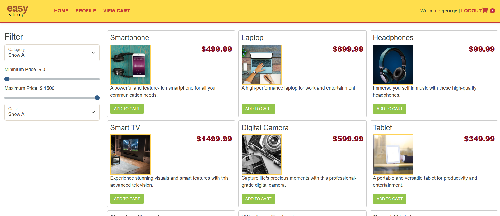
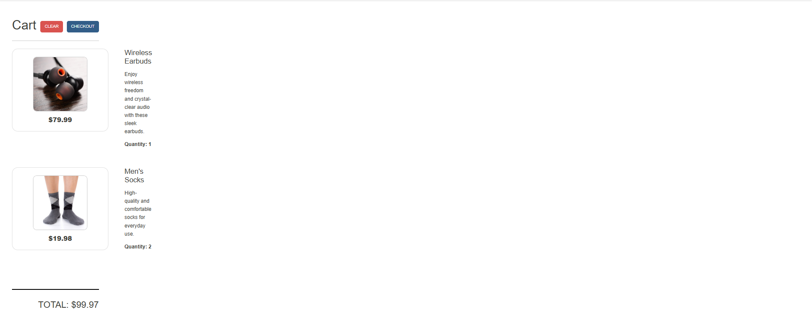
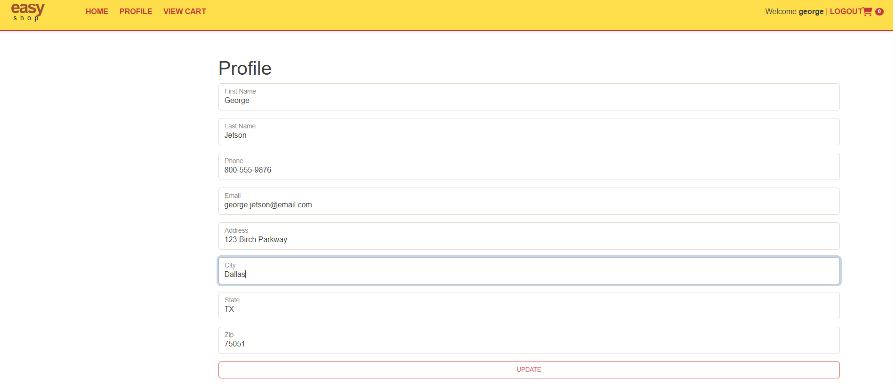
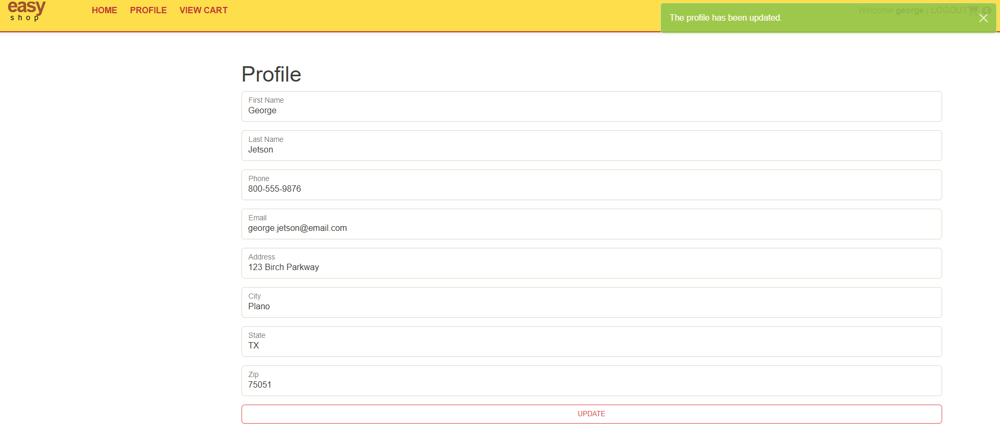
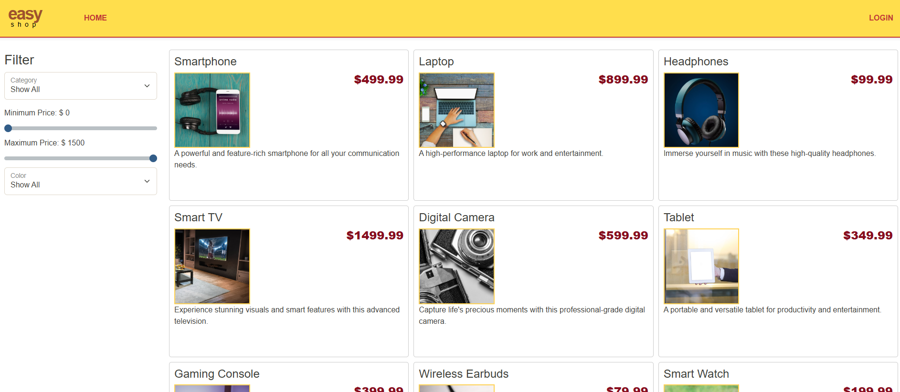
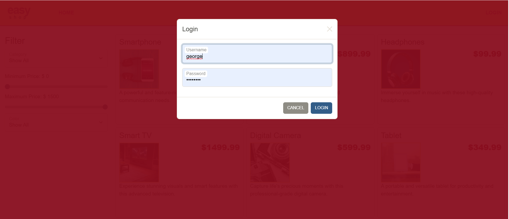
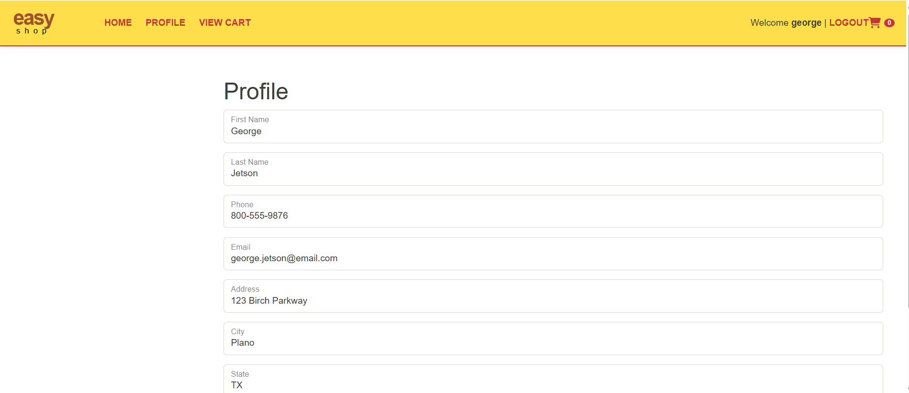
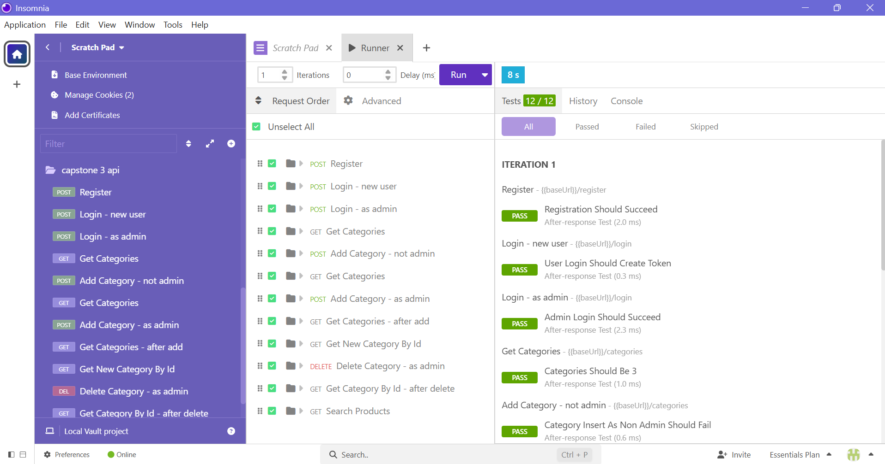
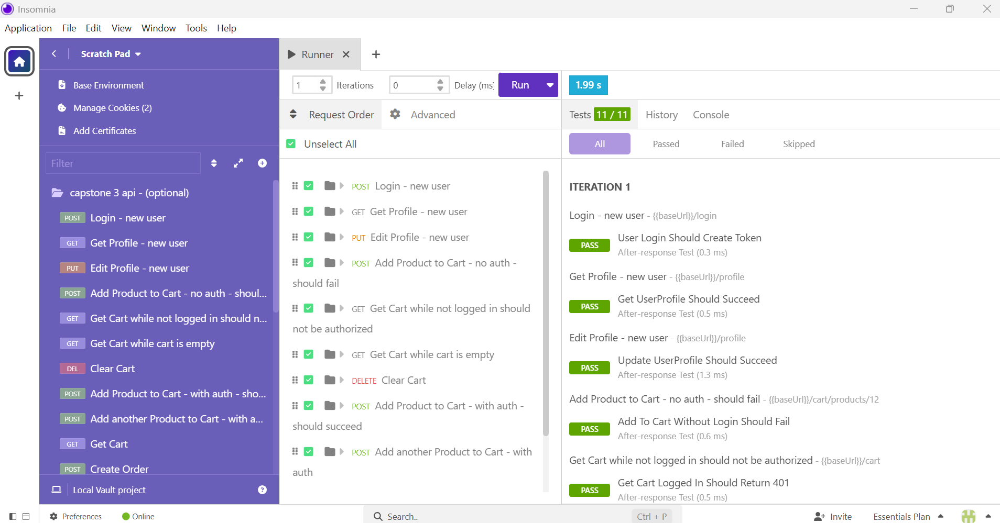

# 🛒 EasyShop 

A Java Spring Boot REST API for an e-commerce application that supports browsing products, managing a shopping cart, checking out orders, and securely handling users and profiles.

This project focuses on **backend workflows** and secure, user-scoped data access.

---

## ✨ Features

### 🗂 Categories & Products
- View all product categories
- Browse products by category
- Search products using optional filters:
   - category
   - price range
   - subcategory
- Admin-only product and category management

---

### 🧺 Shopping Cart
- Each authenticated user has their own shopping cart
- Add products to the cart
- Update product quantities
- Automatically recalculates totals

---

### 📦 Orders & Checkout
- Converts shopping cart into an order
- Creates order line items for each product
- Stores product price at time of purchase

---

### 👤 Users & Profiles
- Secure authentication using Spring Security
- Profiles are separate from authentication data
- Authenticated users can view and update their own profile
- Passwords are never exposed in API responses

---

## 🧠 Project Structure

The backend follows a layered architecture:

Controller → DAO Interface → MySQL DAO → Database


```java

- **Controllers** handle HTTP requests and security
- **DAO Interfaces** define application behavior
- **MySQL DAOs** contain SQL and database logic
- **Models** represent application data only

This structure keeps responsibilities clearly separated and the codebase easy to maintain.

---

## 🌐 Example API Routes

GET /categories
GET /products
GET /products?cat=1&minPrice=10
GET /cart
POST /cart/products/{id}
PUT /cart/products/{id}
POST /orders
GET /profile
PUT /profile

```
---
# Website Screenshots

## Cart Before Checkout

## Cart After Checkout

## Profile Before Update

## Profile After Update

## Logout After Profile Update

## Login Page

## Login Back In - Profile Updates

---
# Insomnia Tests Results


---

# 🧩 Aliza's Interesting Code Example
```java
// this tells spring the class should be created and managed by spring
@Component
// it implements the interface, spring will create one instance of this class and inject whenever categorydao is needed
public class MySqlCategoryDao extends MySqlDaoBase implements CategoryDao {
    public MySqlCategoryDao(DataSource dataSource) {

        super(dataSource);
    }

    @Override
    // gives all categories as java objects
    public List<Category> getAllCategories() {

        // the list starts empty
        // the array list that will hold all the category objects
        // returned even if no rows exist
        ArrayList<Category> categories = new ArrayList<>();
        // getting all columns under categories
        // the database will return raw rows not category objects
        String sql = "SELECT * FROM categories";

        try (
                // using the getconnection() method from MySqlDaoBase - cant directly use datasource cause its private
                Connection connection = getConnection();
                // preparing and executing the statment
                PreparedStatement preparedStatement = connection.prepareStatement(sql);
                // esecuteQuery runs the SELECT
                // resultset now holds all the returned database rows
                ResultSet resultSet = preparedStatement.executeQuery())
        // try with reousrces automatially closes eveything
        {
            // loop through each returned row by the database
            while (resultSet.next()) {
                // converts the current row into category object
                // mapRow :
                // reads the values from the row > creates the cat obj ( container ) > puts the values inside the container
                Category category = mapRow(resultSet);
                // add the fully populated cat obj in the arraylist
                categories.add(category);
            }
        } catch (SQLException e) {
            throw new RuntimeException("Error retrieving all categories", e);
        }
        // retuns the list of cat objs
        // if no rows existed, the list will be empty not NULL
        return categories;
    }
}
```

# 🛠 Tech Stack
Java 17

Spring Boot

Spring Security

JDBC (DAO pattern)

MySQL

Maven

